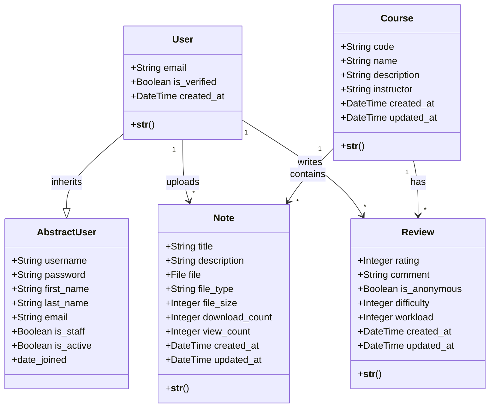
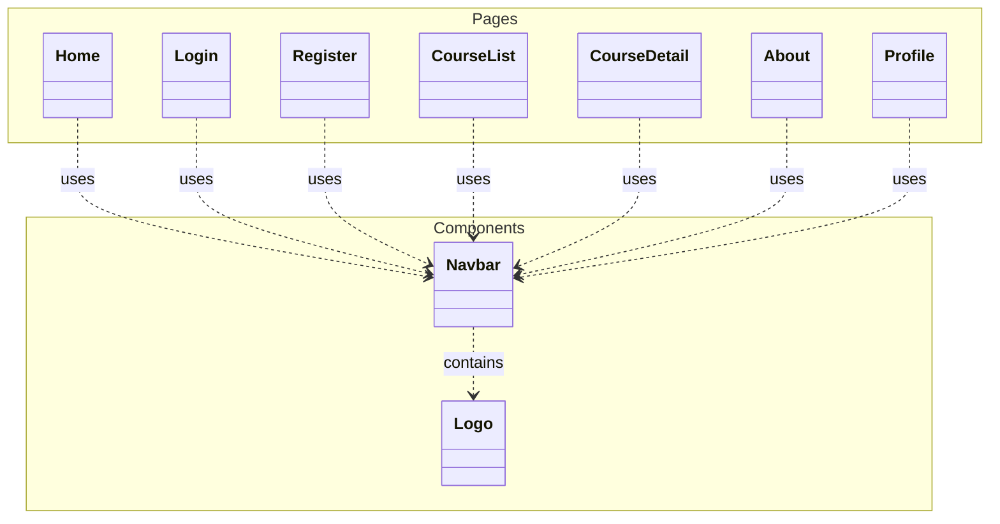
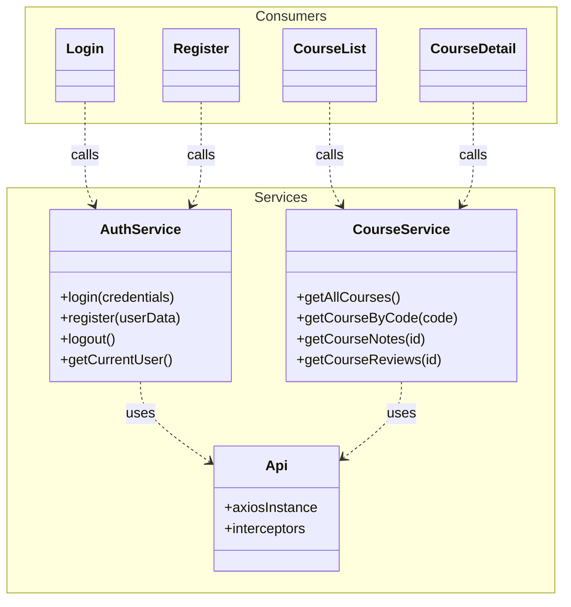

# Notla Project UML Diagrams

This document contains UML diagrams for the project. To ensure clarity and readability, the Frontend architecture has been split into **UI Structure** and **Logic & Services**, making them comparable in size and complexity to the **Backend Models** diagram.

## 1. Backend Class Diagram (Django Models)

Represents the database schema, domain entities, and their inheritance.

## 2. Frontend UI Structure (React Pages & Components)

Represents the visual hierarchy and composition of the application.

## 3. Frontend Logic & Services

Represents the data layer, API communication, and their consumers.

## Description

### Backend
- **User**: Extends Django's `AbstractUser` to add email-based login and verification.
- **Course**: Core entity representing university courses.
- **Note** & **Review**: Related entities linked to both Users and Courses.

### Frontend
- **UI Structure**: Shows how Pages compose reusable Components like `Navbar`.
- **Logic & Services**: Shows how Pages interact with Services to fetch data, and how Services use the central `Api` configuration.
